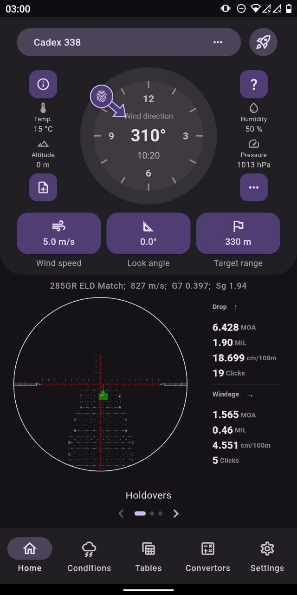
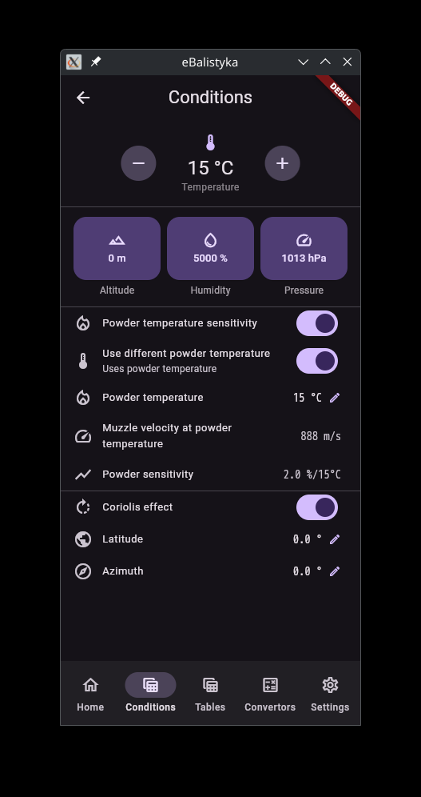
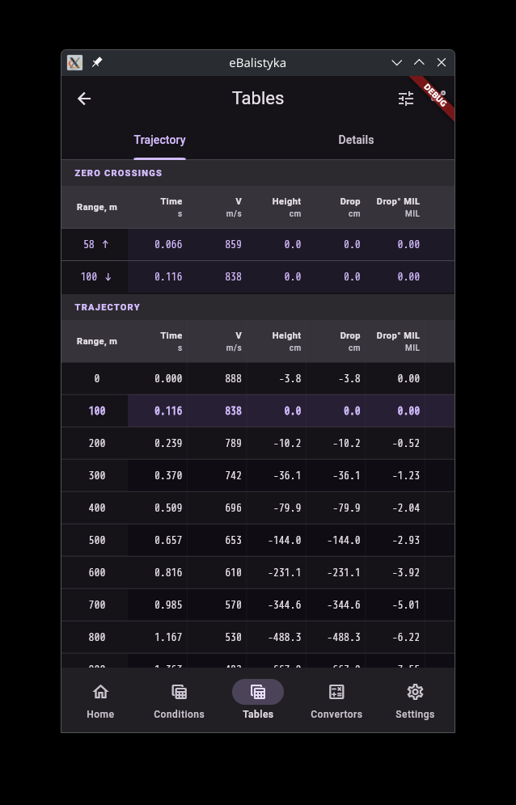
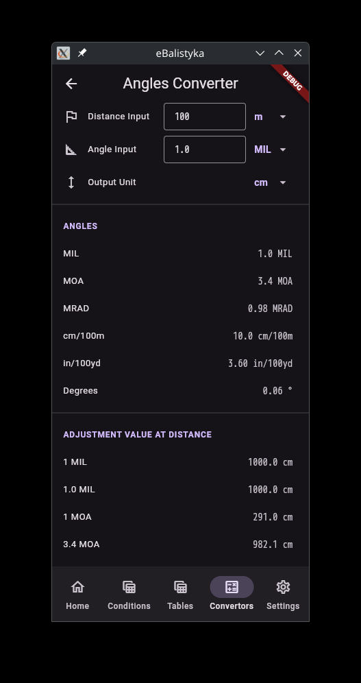
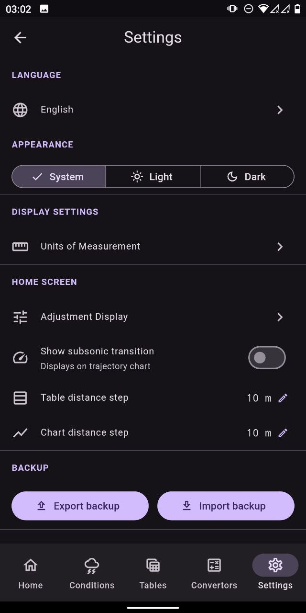

# ebalistyka

[](https://github.com/o-murphy/ebalistyka-app/actions/workflows/build-appimage.yml)
[](https://github.com/o-murphy/ebalistyka-app/actions/workflows/build-exe.yml)
[](https://flutter.dev)
[](LICENSE)


> [!WARNING]
> **Alpha software.** Expect breaking changes, incomplete features, and rough edges.

A cross-platform ballistic trajectory calculator built with Flutter. Powered by [bclibc](external/bclibc) — a high-performance C++ ballistic solver engine with RK4/Euler integration.

---

## Screenshots

> [!NOTE]
> Screenshots can be updated on changes.

| Home | Conditions | Trajectory Tables |
|------|-----------|-------------------|
|  |  |  |

| Convertors | Settings |
|------------|----------|
|  |  |

---

## Features

- **Shooting profiles** — create and manage profiles combining weapon, ammunition, and sight configurations
- **Weapon, ammo & sight wizards** — step-by-step setup with optional import from built-in collections
- **Trajectory tables** — compute and display ballistic tables
- **Environmental conditions** — input atmosphere, wind, and target parameters for corrected solutions
- **Unit converters** — length, weight, pressure, temperature, angular units, torque
- **Configurable units** — choose your preferred measurement system in settings
- **Adjustment display** — customise how turret/holdover corrections are shown

---

## Architecture

```
ebalistyka-app/
├── lib/
│   ├── features/          # Screen-level feature modules
│   │   ├── home/          # Profiles & shot details
│   │   ├── conditions/    # Environmental input
│   │   ├── tables/        # Trajectory tables & export
│   │   ├── convertors/    # Unit converters
│   │   └── settings/      # App settings
│   ├── core/              # Providers, coordinators
│   └── shared/            # Icons, shared widgets
├── packages/
│   ├── bclibc_ffi/        # Dart FFI bindings for the C++ solver
│   └── ebalistyka_db/     # ObjectBox data layer
└── external/
    └── bclibc/            # C++ ballistic solver engine (LGPL-3, git submodule)
```

**State management:** Riverpod  
**Navigation:** go_router  
**Local database:** ObjectBox  
**Ballistic engine:** bclibc (C++ via FFI)

---

## Building

### Prerequisites

- [Flutter](https://docs.flutter.dev/get-started/install) ≥ 3.41.6 (stable channel)
- CMake ≥ 3.13
- C++17 compiler (GCC / Clang on Linux, MSVC 2022 on Windows)

### Clone

```bash
git clone --recurse-submodules https://github.com/o-murphy/ebalistyka-app.git
cd ebalistyka-app
```

### Linux

```bash
# Install system dependencies (Ubuntu/Debian)
sudo apt-get install -y \
  clang cmake ninja-build pkg-config \
  libgtk-3-dev liblzma-dev libstdc++-12-dev \
  libclang-dev fuse libfuse2

# Install Flutter packages
flutter pub get

# Generate FFI bindings
cd packages/bclibc_ffi && dart run ffigen --config ffigen.yaml && cd ../..

# Build
flutter build linux --release
```

The output bundle is at `build/linux/x64/release/bundle/`.

### Windows

```powershell
# Requires Visual Studio 2022 with C++ workload

flutter pub get

cd packages\bclibc_ffi
dart run ffigen --config ffigen.yaml
cd ..\..

flutter build windows --release
```

The output is at `build\windows\x64\runner\Release\`.

### CI

GitHub Actions workflows are provided for automated builds:

| Workflow | Trigger |
|----------|---------|
| `build-appimage.yml` | PR to `main`/`develop` → Linux AppImage |
| `build-exe.yml` | PR to `main`/`develop` → Windows EXE |
| `build.yml` | Reusable — called by the above |

---

## Dependencies

| Package | Role |
|---------|------|
| [bclibc](external/bclibc) | C++ ballistic solver engine — LGPL-3 |
| [flutter_riverpod](https://pub.dev/packages/flutter_riverpod) | State management |
| [go_router](https://pub.dev/packages/go_router) | Navigation |
| [objectbox](https://pub.dev/packages/objectbox_flutter_libs) | Local database |
| [protobuf](https://pub.dev/packages/protobuf) | Data serialisation |

---

## License

Copyright (C) 2024 o-murphy

This program is free software: you can redistribute it and/or modify it under the terms of the **GNU General Public License v3.0** as published by the Free Software Foundation.

See [LICENSE](LICENSE) for the full text. See [CHANGELOG](CHANGELOG.md) for release history.

> [!NOTE]
> `bclibc` (the ballistic solver engine, located in `external/bclibc`) is licensed separately under the **GNU Lesser General Public License v3.0**. See [`external/bclibc/LICENSE`](external/bclibc/LICENSE).
