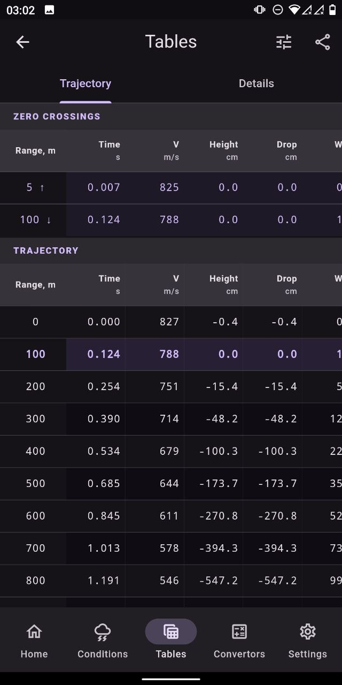
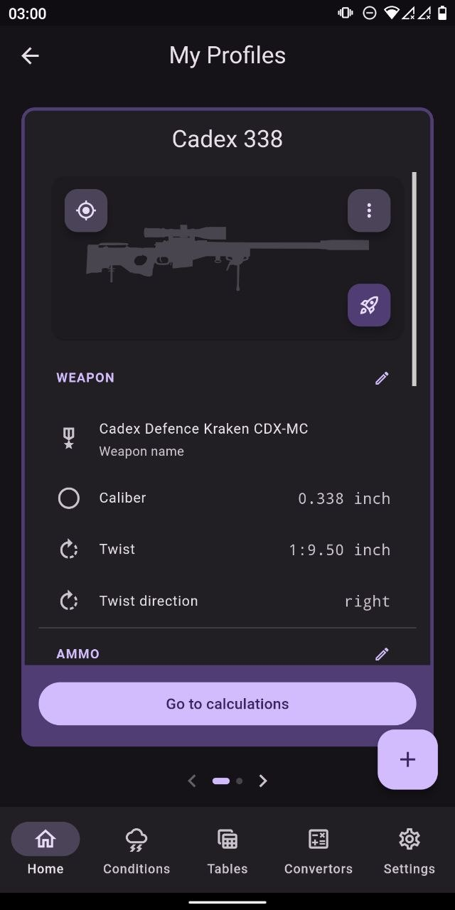
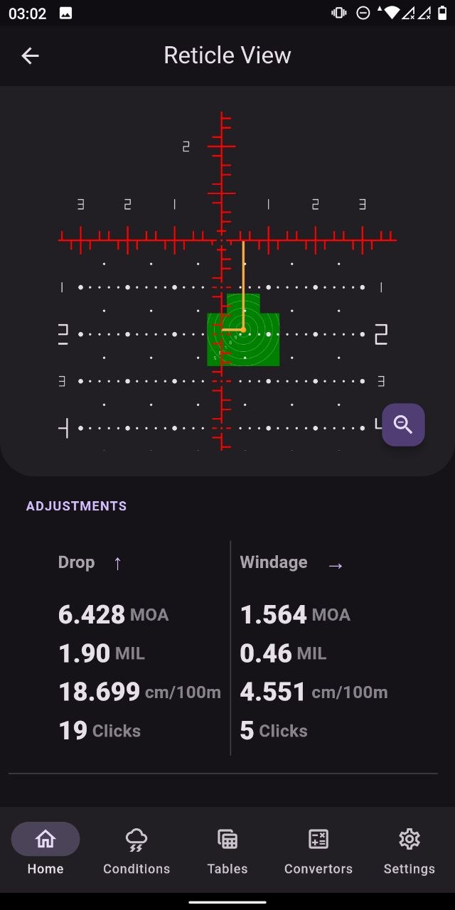

# ebalistyka

[![Made in Ukraine]][SWUBadge]

[![License]](LICENSE)
[![Release]][GitHub Release Latest]
![Status]
[![Flutter Shield]][Flutter]
![Linux] ![Windows] ![Android]

<a href='https://snapcraft.io/ebalistyka'></a>
<!-- <a href='https://flathub.org/apps/com.o.murphy.ebalistyka'></a> -->

[](https://github.com/o-murphy/ebalistyka-app/actions/workflows/build-appimage.yml)
[](https://github.com/o-murphy/ebalistyka-app/actions/workflows/build-snap.yml)
[](https://github.com/o-murphy/ebalistyka-app/actions/workflows/build-exe.yml)
[](https://github.com/o-murphy/ebalistyka-app/actions/workflows/build-apk.yml)


> [!WARNING]
> **Alpha software.** Expect breaking changes, incomplete features, and rough edges.

A cross-platform ballistic trajectory calculator built with Flutter. Powered by [bclibc](external/bclibc) — a high-performance (3-DOF + spin drift) C++ ballistic solver engine with RK4/Euler integration.

_UI/UX inspired by the [**Strilets**](https://download.strilets.tech/) ballistic calculator app_

---

## Screenshots

<table>
  <tr>
    <td align="center"><b>Home</b></td>
    <td align="center"><b>Conditions</b></td>
    <td align="center"><b>Trajectory Tables</b></td>
  </tr>
  <tr>
    <td></td>
    <td></td>
    <td></td>
  </tr>
  <tr>
    <td align="center"><b>Convertors</b></td>
    <td align="center"><b>My Profiles</b></td>
    <td align="center"><b>Reticle</b></td>
  </tr>
  <tr>
    <td></td>
    <td></td>
    <td></td>
  </tr>
</table>

---

## Table of Contents

- [ebalistyka](#ebalistyka)
  - [Screenshots](#screenshots)
  - [Table of Contents](#table-of-contents)
  - [Features](#features)
  - [Download \& Installation](#download--installation)
    - [Linux — run](#linux--run)
    - [Linux — Snap](#linux--snap)
    - [Linux — AppImage update](#linux--appimage-update)
    - [Windows — install MSIX](#windows--install-msix)
    - [Android — install APK](#android--install-apk)
  - [Architecture](#architecture)
  - [Building](#building)
    - [Prerequisites](#prerequisites)
    - [Clone](#clone)
    - [Linux](#linux)
    - [Windows](#windows)
    - [Android](#android)
    - [CI](#ci)
  - [Android notes](#android-notes)
    - [Impeller disabled](#impeller-disabled)
    - [File import](#file-import)
  - [Dependencies](#dependencies)
    - [App (`ebalistyka`)](#app-ebalistyka)
    - [`packages/bclibc_ffi`](#packagesbclibc_ffi)
    - [`packages/ebalistyka_db`](#packagesebalistyka_db)
    - [`packages/a7p`](#packagesa7p)
    - [`packages/reticle_gen`](#packagesreticle_gen)
  - [License](#license)

---

## Features

- **Shooting profiles** — create and manage profiles combining weapon, ammunition, and sight configurations
- **Weapon, ammo & sight wizards** — step-by-step setup with optional import from a built-in collection
- **Trajectory tables** — compute and display ballistic tables with HTML export
- **Environmental conditions** — atmosphere, wind, Coriolis, target parameters
- **Reticle view** — SVG mil-reticle with live drop/windage adjustment indicator, theme-aware colours
- **Multi-BC & custom drag** — G1/G7 multi-BC tables and full custom drag curve support
- **Powder sensitivity** — temperature-based MV correction tables
- **Configurable units** — choose your preferred measurement system per quantity in settings
- **Adjustment display** — arrows / signs / letters format, configurable in settings
- **Import / Export** — profiles in `.ebcp` (native) and `.a7p` (Archer Ballistic Profile) formats; full backup via Settings

---

## Download & Installation

Latest release: **[GitHub Releases][GitHub Release Latest]**

| Platform                | File                                                          | Notes                                                                     |
| ----------------------- | ------------------------------------------------------------- | ------------------------------------------------------------------------- |
| Linux x86_64            | [ebalistyka_linux_x86_64.AppImage][DownloadAppImageAmd64]     | requires FUSE 2                                                           |
| Linux x86_64 (portable) | [ebalistyka_linux_x86_64.tar.gz][DownloadLinuxArchiveAmd64]   | no FUSE required                                                          |
| Linux x86_64 (snap)     | [ebalistyka_linux_x86_64.snap][DownloadLinuxSnapAmd64]        | or `snap install ebalistyka`                                              |
| Linux arm64             | [ebalistyka_linux_aarch64.AppImage][DownloadAppImageArm64]    | requires FUSE 2                                                           |
| Linux arm64 (portable)  | [ebalistyka_linux_aarch64.tar.gz][DownloadLinuxArchiveArm64]  | no FUSE required                                                          |
| Linux arm64 (snap)      | [ebalistyka_linux_aarch64.snap][DownloadLinuxSnapArm64]       | or `snap install ebalistyka`                                              |
| Windows x64             | [ebalistyka_windows_x86_64.msix][DownloadWindowsMsixAmd64]    | install [ebalistyka_cert.cer][DownloadWindowsMsixCer] first (self-signed) |
| Windows x64 (portable)  | [ebalistyka_windows_x86_64.zip][DownloadWindowsArchiveAmd64]  | extract and run                                                           |
| Android arm64           | [ebalistyka_android_arm64.apk][DownloadAndroidApkArm64]       | enable "Install from unknown sources"                                     |
| Android armv7           | [ebalistyka_android_armeabi_v7a.apk][DownloadAndroidApkARMv7] | enable "Install from unknown sources"                                     |
| Android x86_64          | [ebalistyka_android_x86_64.apk][DownloadAndroidApkAmd64]      | enable "Install from unknown sources"                                     |

### Linux — run

```bash
chmod +x ebalistyka_linux_x86_64.AppImage
./ebalistyka_linux_x86_64.AppImage
```

If FUSE 2 is not available on your system:

```bash
./ebalistyka_linux_x86_64.AppImage --appimage-extract-and-run
```

### Linux — Snap

Install from the Snap Store (auto-updates included):

```bash
sudo snap install ebalistyka
```

Or sideload a `.snap` file from GitHub Releases:

```bash
sudo snap install ebalistyka_linux_x86_64.snap --dangerous
```

### Linux — AppImage update

Updates are delivered via **zsync**. Download [AppImageUpdate](https://github.com/AppImageCommunity/AppImageUpdate/releases/latest), then run:

```bash
chmod +x AppImageUpdate-x86_64.AppImage
./AppImageUpdate-x86_64.AppImage ebalistyka_linux_x86_64.AppImage
```

The tool fetches only the changed blocks from the latest GitHub Release — no need to re-download the full file.

### Windows — install MSIX

The MSIX is signed with a self-signed certificate. Before installing, trust the certificate:

1. Download [`ebalistyka_cert.cer`][DownloadWindowsMsixCer] from the release
2. Double-click → **Install Certificate** → **Local Machine** → **Trusted Root Certification Authorities**
3. Install [`ebalistyka_windows_x86_64.msix`][DownloadWindowsMsixAmd64]

### Android — install APK

Download the APK for your device ABI from the release and open it to install — if unsure, pick the `universal` APK. Android will verify the app via Google Play before installing.

---

## Architecture

```
ebalistyka-app/
├── lib/
│   ├── features/              # Screen-level feature modules
│   │   ├── home/              # Main screen: profiles, shot, reticle, chart, tables
│   │   ├── conditions/        # Environmental conditions input
│   │   ├── tables/            # Trajectory tables & HTML export
│   │   ├── convertors/        # Unit converters (angular, velocity, length, …)
│   │   └── settings/          # App settings (units, adjustments, theme, locale)
│   ├── core/
│   │   ├── providers/         # Riverpod providers (app state, settings, DB, l10n)
│   │   ├── extensions/        # Typed getters/setters on ObjectBox entities
│   │   ├── formatting/        # UnitFormatterImpl — localized value formatting
│   │   ├── models/            # FieldConstraints and other shared models
│   │   ├── services/          # A7pService, import/export orchestration
│   │   └── collection/        # Built-in weapon/ammo/sight collection assets
│   ├── shared/
│   │   ├── widgets/           # Reusable widgets (pickers, inputs, dialogs, wizards)
│   │   ├── models/            # UI-layer models (AdjustmentData, ChartPoint, …)
│   │   ├── helpers/           # Formatting helpers, drag model info
│   │   ├── mixins/            # WizardFormMixin
│   │   └── constants/         # UI dimensions, null string sentinel
│   ├── update/                # Update checker and utilities
│   └── l10n/                  # Generated AppLocalizations (EN + UA)
├── packages/
│   ├── bclibc_ffi/            # Dart FFI bindings for the C++ solver
│   ├── ebalistyka_db/         # ObjectBox schema + .ebcp export DTOs
│   ├── a7p/                   # .a7p protobuf encode/decode + ProfileExport converter
│   └── reticle_gen/           # SVG mil-reticle generator
└── external/
    └── bclibc/                # C++ ballistic solver engine (LGPL-3, git submodule)
```

**State management:** Riverpod  
**Navigation:** go_router  
**Local database:** ObjectBox  
**Ballistic engine:** bclibc (C++ via FFI)  
**Localisation:** Flutter ARB / `flutter_localizations` (EN + UA)

---

## Building

### Prerequisites

- [Flutter](https://docs.flutter.dev/get-started/install) ≥ 3.41.7 (stable channel)
- CMake ≥ 3.13
- C++17 compiler (GCC / Clang on Linux, MSVC 2022 on Windows)

### Clone

```bash
git clone --recurse-submodules https://github.com/o-murphy/ebalistyka-app.git
cd ebalistyka-app
```

### Linux

```bash
# System dependencies (Ubuntu/Debian)
sudo apt-get install -y \
  clang cmake ninja-build pkg-config \
  libgtk-3-dev liblzma-dev libstdc++-12-dev \
  libclang-dev fuse libfuse2

flutter pub get
cd packages/bclibc_ffi && dart run ffigen --config ffigen.yaml && cd ../..
flutter build linux --release
```

Output: `build/linux/x64/release/bundle/`

### Windows

```powershell
# Requires Visual Studio 2022 with C++ workload
flutter pub get
cd packages\bclibc_ffi; dart run ffigen --config ffigen.yaml; cd ..\..
flutter build windows --release
```

Output: `build\windows\x64\runner\Release\`

### Android

```bash
flutter pub get
cd packages/bclibc_ffi && dart run ffigen --config ffigen.yaml && cd ../..
flutter build apk --release --target-platform android-arm64
```

Output: `build/app/outputs/flutter-apk/app-release.apk`

### CI

GitHub Actions workflows publish a GitHub Release on every push to `main`:

| Workflow             | Artifact                                    |
| -------------------- | ------------------------------------------- |
| `build-appimage.yml` | Linux AppImage (x86_64 + aarch64)           |
| `build-snap.yml`     | Linux Snap (x86_64 + aarch64)               |
| `build-exe.yml`      | Windows MSIX installer                      |
| `build-apk.yml`      | Android APK (arm64 + armv7 + x86_64)        |
| `build.yml`          | Reusable build workflow called by the above |
| `publish.yml`        | Publishes to Snap Store on GitHub Release   |

---

## Android notes

### Impeller disabled

Flutter's Impeller renderer (enabled by default on Android since Flutter 3.16) tessellates SVG paths — including circles — into coarse polygons, which makes reticle and target SVGs look jagged. Until Flutter/Impeller resolves path tessellation quality for small shapes, Impeller is **explicitly disabled** for Android in `android/app/src/main/AndroidManifest.xml`:

```xml
<meta-data
    android:name="io.flutter.embedding.android.EnableImpeller"
    android:value="false" />
```

This forces the app to use **Skia**, which renders SVG circles smoothly. Re-enable Impeller only after verifying that circle/arc quality is acceptable on your target Android version.

### File import

On Android, `file_picker` cannot filter by custom extensions (`.ebcp`, `.a7p`) because Android does not know their MIME types. The import dialogs open with `FileType.any` and validate the extension after the user selects a file. Selecting a wrong file type shows an error message.

---

## Dependencies

### App (`ebalistyka`)

| Package                                                                 | Role                                         |
| ----------------------------------------------------------------------- | -------------------------------------------- |
| [flutter_riverpod](https://pub.dev/packages/flutter_riverpod)           | State management                             |
| [go_router](https://pub.dev/packages/go_router)                         | Navigation                                   |
| [flutter_localizations](https://pub.dev/packages/flutter_localizations) | EN + UA localisation                         |
| [flutter_svg](https://pub.dev/packages/flutter_svg)                     | SVG reticle & target rendering               |
| [window_manager](https://pub.dev/packages/window_manager)               | Desktop window size / title / icon           |
| [file_picker](https://pub.dev/packages/file_picker)                     | Import file picker                           |
| [share_plus](https://pub.dev/packages/share_plus)                       | Export / share files                         |
| [url_launcher](https://pub.dev/packages/url_launcher)                   | External links                               |
| [package_info_plus](https://pub.dev/packages/package_info_plus)         | App version info                             |
| [flutter_markdown_plus](https://pub.dev/packages/flutter_markdown_plus) | App help widgets                             |
| [ota_update](https://pub.dev/packages/ota_update)                       | autoupdate for Android sideloadinstallations |

### `packages/bclibc_ffi`

| Package                             | Role                                                           |
| ----------------------------------- | -------------------------------------------------------------- |
| [bclibc](external/bclibc)           | C++ ballistic solver engine (3-DOF + spin drift, RK4) — LGPL-3 |
| [ffi](https://pub.dev/packages/ffi) | Dart ↔ C FFI bindings                                          |

### `packages/ebalistyka_db`

| Package                                                      | Role                           |
| ------------------------------------------------------------ | ------------------------------ |
| [objectbox](https://pub.dev/packages/objectbox_flutter_libs) | Local database                 |
| [archive](https://pub.dev/packages/archive)                  | `.ebcp` zip archive read/write |
| [json_annotation](https://pub.dev/packages/json_annotation)  | Export DTO serialisation       |

### `packages/a7p`

| Package                                       | Role                          |
| --------------------------------------------- | ----------------------------- |
| [protobuf](https://pub.dev/packages/protobuf) | `.a7p` protobuf encode/decode |
| [crypto](https://pub.dev/packages/crypto)     | `.a7p` checksum verification  |

### `packages/reticle_gen`

| Package                             | Role                   |
| ----------------------------------- | ---------------------- |
| [xml](https://pub.dev/packages/xml) | SVG reticle generation |

---

## License

Copyright (C) 2026 Yaroshenko Dmytro (o-murphy)

This program is free software: you can redistribute it and/or modify it under the terms of the **GNU General Public License v3.0** as published by the Free Software Foundation.

See [LICENSE](LICENSE) for the full text. See [CHANGELOG](CHANGELOG.md) for release history.

> [!NOTE]
> `bclibc` (the ballistic solver engine, located in `external/bclibc`) is licensed separately under the **GNU Lesser General Public License v3.0**. See [`external/bclibc/LICENSE`](external/bclibc/LICENSE).

> [!WARNING]
> **Risk notice.** This application performs approximate simulations of complex physical processes. Calculation results must not be considered as completely or reliably reflecting actual projectile behaviour. Results may be used for educational purposes only and must not be relied upon in any context where an incorrect calculation could cause financial harm or put a human life at risk.
>
> THE SOFTWARE IS PROVIDED "AS IS", WITHOUT WARRANTY OF ANY KIND, EXPRESS OR IMPLIED, INCLUDING BUT NOT LIMITED TO THE WARRANTIES OF MERCHANTABILITY, FITNESS FOR A PARTICULAR PURPOSE AND NONINFRINGEMENT. IN NO EVENT SHALL THE AUTHORS OR COPYRIGHT HOLDERS BE LIABLE FOR ANY CLAIM, DAMAGES OR OTHER LIABILITY, WHETHER IN AN ACTION OF CONTRACT, TORT OR OTHERWISE, ARISING FROM, OUT OF OR IN CONNECTION WITH THE SOFTWARE OR THE USE OR OTHER DEALINGS IN THE SOFTWARE.


<!-- REUSABLE LINKS -->


[Made in Ukraine]:https://img.shields.io/badge/made_in-Ukraine-ffd700.svg?labelColor=0057b7&style=flat-square
[SWUBadge]: https://stand-with-ukraine.pp.ua

[Flutter Shield]: https://img.shields.io/badge/Flutter-3.41.7-02569B?logo=flutter
[Flutter]: https://flutter.dev

[Release]: https://img.shields.io/github/v/release/o-murphy/ebalistyka-app?cacheSeconds=0
[GitHub Release Latest]: https://github.com/o-murphy/ebalistyka-app/releases/latest

[License]: https://img.shields.io/badge/License-GPL%20v3-blue.svg
[Status]: https://img.shields.io/badge/status-alpha-orange

[Linux]: https://img.shields.io/badge/Linux-x86__64%20%7C%20arm64-grey?logo=linux&logoColor=black&labelColor=FCC624

[Windows]: https://img.shields.io/badge/x86__64-grey?logo=windows&logoColor=black&label=Windows&labelColor=0078D4

[Android]: https://img.shields.io/badge/Android-arm64%20%7C%20armv7%20%7C%20x86__64-grey?logo=android&logoColor=white&labelColor=3DDC84


<!-- DOWNLOADS -->
[DownloadAppImageAmd64]: https://github.com/o-murphy/ebalistyka-app/releases/latest/download/ebalistyka_linux_x86_64.AppImage
[DownloadLinuxArchiveAmd64]: https://github.com/o-murphy/ebalistyka-app/releases/latest/download/ebalistyka_linux_x86_64.tar.gz
[DownloadLinuxSnapAmd64]: https://github.com/o-murphy/ebalistyka-app/releases/latest/download/ebalistyka_linux_x86_64.snap
[DownloadAppImageArm64]: https://github.com/o-murphy/ebalistyka-app/releases/latest/download/ebalistyka_linux_aarch64.AppImage
[DownloadLinuxArchiveArm64]: https://github.com/o-murphy/ebalistyka-app/releases/latest/download/ebalistyka_linux_aarch64.tar.gz
[DownloadLinuxSnapArm64]: https://github.com/o-murphy/ebalistyka-app/releases/latest/download/ebalistyka_linux_aarch64.snap
[DownloadWindowsMsixAmd64]: https://github.com/o-murphy/ebalistyka-app/releases/latest/download/ebalistyka_windows_x86_64.msix
[DownloadWindowsMsixCer]: https://github.com/o-murphy/ebalistyka-app/releases/latest/download/ebalistyka_cert.cer
[DownloadWindowsArchiveAmd64]: https://github.com/o-murphy/ebalistyka-app/releases/latest/download/ebalistyka_windows_x86_64.zip
[DownloadAndroidApkArm64]: https://github.com/o-murphy/ebalistyka-app/releases/latest/download/ebalistyka_android_arm64.apk
[DownloadAndroidApkARMv7]: https://github.com/o-murphy/ebalistyka-app/releases/latest/download/ebalistyka_android_armeabi_v7a.apk
[DownloadAndroidApkAmd64]: https://github.com/o-murphy/ebalistyka-app/releases/latest/download/ebalistyka_android_x86_64.apk